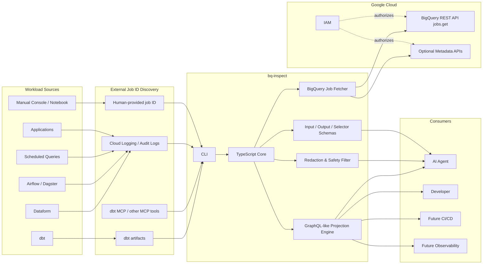
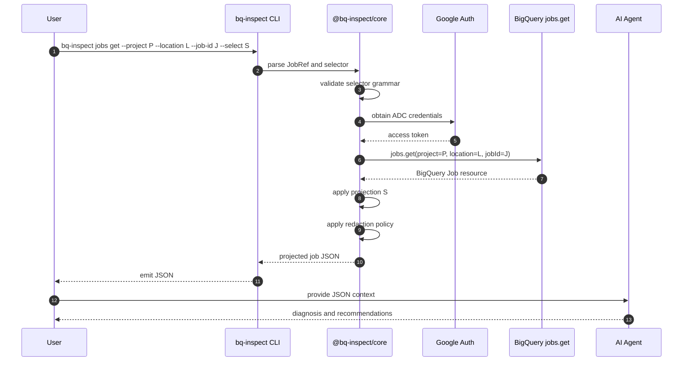
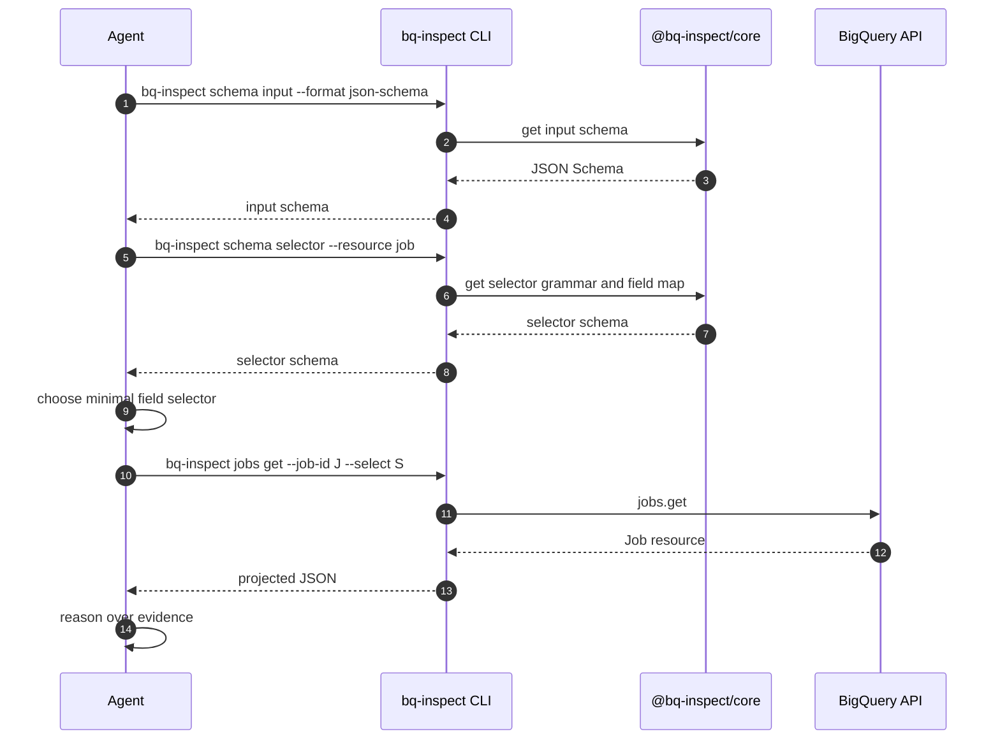
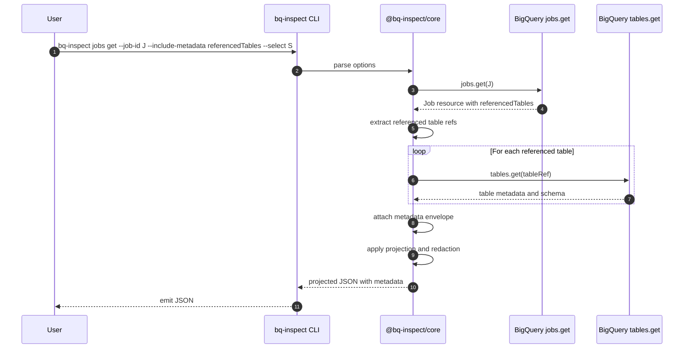
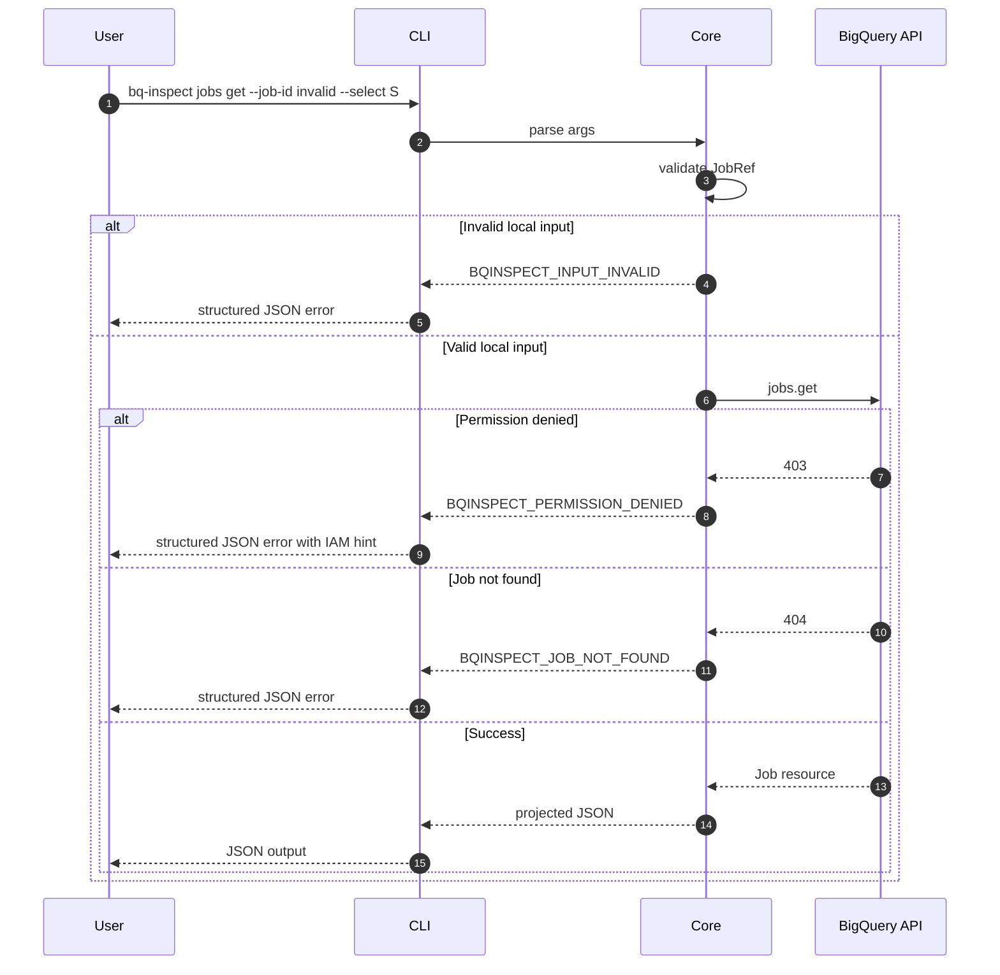

# RFC: `bq-inspect` — Read-Only BigQuery Job Inspection CLI for AI Agents

**Status:** Draft
**Authors:** Product/Engineering
**Last updated:** 2026-05-14
**Target audience:** Data platform engineers, analytics engineers, AI-agent platform engineers, security/IAM reviewers, SRE/FinOps teams
**Primary implementation language:** TypeScript
**Primary artifact:** CLI + reusable TypeScript core library

---

## 1. Executive Summary

`bq-inspect` is a read-only, TypeScript-based CLI for inspecting BigQuery jobs and emitting compact, structured JSON context for AI agents.

The first version focuses on explicit BigQuery job IDs. It does **not** depend on dbt, although dbt or other workflow systems may be used externally to discover job IDs. The CLI fetches BigQuery Job resources, applies a GraphQL-like field projection, and returns JSON that agents can use to diagnose cost, performance, reliability, governance, and query-behavior issues.

The central design goal is:

> Give AI agents enough BigQuery workload evidence to reason and optimize, without granting them data-read, mutation, or query-execution capabilities.

`bq-inspect` should therefore be positioned as a deterministic, read-only **BigQuery job context compiler** for AI agents.

---

## 2. Problem Statement

Modern BigQuery workloads are often generated by higher-level systems such as dbt, Dataform, Airflow, Dagster, scheduled queries, notebooks, application services, or manual console usage. When queries are slow, expensive, flaky, or governance-sensitive, engineers need to inspect the resulting BigQuery jobs.

BigQuery Job metadata contains rich diagnostic information, including query statistics, query plan stages, timeline samples, slot usage, referenced tables, billing-related bytes, cache behavior, materialized view usage, metadata cache usage, and error status. This metadata is highly valuable for AI agents, but the raw API response can be large, inconsistent in optional fields, and inefficient to pass directly into model context.

At the same time, granting AI agents broad BigQuery access is risky. Agents should not accidentally execute queries, read table data, mutate resources, or exfiltrate sensitive data.

`bq-inspect` addresses this gap by providing a controlled, read-only interface for inspecting known BigQuery jobs and projecting only the fields needed for a specific diagnostic task.

---

## 3. Goals

### 3.1 Product Goals

1. Provide a CLI named `bq-inspect` for inspecting BigQuery jobs by explicit job ID.
2. Emit JSON optimized for AI-agent consumption.
3. Preserve the raw BigQuery Job resource shape where practical.
4. Support GraphQL-like field selection to minimize context size.
5. Expose input and output schemas so AI agents can use the CLI autonomously and safely.
6. Support cost, performance, reliability, governance, and developer-productivity workflows.
7. Remain independent from dbt and all other workload orchestrators.
8. Require only read-oriented IAM roles and permissions.
9. Avoid data access and query execution in v1.
10. Provide a reusable TypeScript core library beneath the CLI.

### 3.2 Engineering Goals

1. Deterministic behavior: the CLI should fetch, project, redact, and emit evidence without speculative reasoning.
2. Strong typing: use TypeScript types and JSON Schema for input/output contracts.
3. Testability: support fixture-based tests using captured BigQuery Job JSON.
4. Extensibility: support future renderers, MCP tools, diagnostic rule packs, and workload aggregation.
5. Security by design: explicitly separate metadata/job inspection from table data access and query execution.

### 3.3 AI-Agent Goals

1. Agents can ask for the minimum job fields necessary for a task.
2. Agents can inspect tool schemas before invoking the CLI.
3. Agents can safely inspect job evidence without executing SQL.
4. Agents can use referenced input/output schema metadata, where available, to reason about possible query optimizations.
5. Agents can cite exact source fields when forming hypotheses.

---

## 4. Non-Goals

The following are intentionally out of scope for v1:

1. Running SQL queries.
2. Performing dry runs, because dry runs may still require `bigquery.jobs.create`.
3. Reading query result rows.
4. Previewing table data.
5. Mutating BigQuery datasets, tables, routines, reservations, or jobs.
6. Applying automatic query rewrites.
7. Depending on dbt artifacts or dbt runtime internals.
8. Aggregating workload-level analytics across many jobs.
9. Acting as a full observability platform.
10. Providing a hosted SaaS service.

---

## 5. Background and Source Facts

### 5.1 BigQuery Job Metadata

BigQuery query jobs expose diagnostic plan and timing information that can be retrieved from API responses such as `jobs.get`. Google documents that query jobs include query plan and timing information similar in spirit to `EXPLAIN`, and that this information is embedded in query jobs and retrievable through API methods such as `jobs.get`.

Relevant documentation:

- BigQuery Job resource reference: <https://docs.cloud.google.com/bigquery/docs/reference/rest/v2/Job>
- BigQuery query plan and timeline explanation: <https://docs.cloud.google.com/bigquery/docs/query-plan-explanation>

Important fields for `bq-inspect` include, but are not limited to:

- `status.state`
- `status.errorResult`
- `status.errors`
- `statistics.creationTime`
- `statistics.startTime`
- `statistics.endTime`
- `statistics.totalSlotMs`
- `statistics.finalExecutionDurationMs`
- `statistics.query.totalBytesProcessed`
- `statistics.query.totalBytesBilled`
- `statistics.query.totalSlotMs`
- `statistics.query.cacheHit`
- `statistics.query.statementType`
- `statistics.query.queryPlan`
- `statistics.query.timeline`
- `statistics.query.referencedTables`
- `statistics.query.referencedRoutines`
- `statistics.query.destinationTable`
- `statistics.query.dmlStats`
- `statistics.query.ddlOperationPerformed`
- `statistics.query.ddlTargetTable`
- `statistics.query.materializedViewStatistics`
- `statistics.query.metadataCacheStatistics`
- `statistics.query.performanceInsights`
- `statistics.query.biEngineStatistics`
- `statistics.query.rowLevelSecurityStatistics`
- `statistics.query.dataMaskingStatistics`

### 5.2 IAM and Least Privilege

The CLI should be designed around read-only access. Google Cloud documents predefined BigQuery roles and permissions in the BigQuery IAM roles and permissions reference.

Relevant documentation:

- BigQuery access control: <https://docs.cloud.google.com/bigquery/docs/access-control>
- IAM role details for BigQuery: <https://docs.cloud.google.com/iam/docs/roles-permissions/bigquery>

Important security observation:

- `roles/bigquery.resourceViewer` is appropriate for viewing BigQuery resource and job metadata, including job-related permissions such as job get/list capabilities.
- `roles/bigquery.metadataViewer` is appropriate for table, dataset, model, and routine metadata use cases.
- `roles/bigquery.dataViewer` grants data-read-oriented permissions, including table data access, and should not be required for v1.
- `roles/bigquery.jobUser` grants job creation capability and should not be required for v1 because `bq-inspect` should not run queries.

Recommended v1 IAM posture:

| Capability                                  | Required for v1? | Suggested role or permission posture                                                                     |
| ------------------------------------------- | ---------------: | -------------------------------------------------------------------------------------------------------- |
| Fetch known job metadata                    |              Yes | `roles/bigquery.resourceViewer` or equivalent custom role containing required job inspection permissions |
| Fetch referenced table schemas and metadata |         Optional | `roles/bigquery.metadataViewer` or equivalent custom metadata-only role                                  |
| Read table rows                             |               No | Avoid `roles/bigquery.dataViewer`                                                                        |
| Execute queries or dry runs                 |               No | Avoid `roles/bigquery.jobUser` and `bigquery.jobs.create`                                                |
| Mutate resources                            |               No | Avoid admin/editor roles                                                                                 |

---

## 6. User Personas

### 6.1 Analytics Engineer

Wants to understand why a generated SQL model was slow or expensive. They may use dbt, but `bq-inspect` should only require the resulting job ID.

### 6.2 Data Platform Engineer

Wants a safe CLI and library that can be embedded into internal tools, CI workflows, incident debugging flows, and agentic systems.

### 6.3 AI Agent

Wants to request a minimal set of BigQuery job fields, inspect the evidence, and propose SQL/model/schema/configuration improvements without being able to execute queries or read underlying table data.

### 6.4 Security/IAM Reviewer

Wants proof that the tool can operate without data access, query execution, or mutation permissions.

### 6.5 FinOps/SRE Engineer

Wants to inspect cost, slot usage, query plans, bottlenecks, and failures using deterministic job evidence.

---

## 7. Representative Workflows

### 7.1 Local Developer Workflow

1. A developer runs a workload using dbt, Dataform, or another tool.
2. An external system identifies one or more BigQuery job IDs.
3. The developer invokes `bq-inspect jobs get` with the job ID.
4. The CLI fetches the job resource.
5. The CLI applies a selector.
6. The CLI emits JSON.
7. An AI agent consumes the JSON and suggests optimizations.

### 7.2 AI-Agent Autonomous Inspection Workflow

1. Agent asks `bq-inspect schema input` to learn invocation format.
2. Agent asks `bq-inspect schema selector` to understand selectable fields.
3. Agent selects only relevant fields.
4. Agent invokes `bq-inspect jobs get`.
5. Agent receives projected JSON.
6. Agent forms hypotheses with evidence references.
7. Agent proposes changes to SQL, dbt model config, partitioning, clustering, materialized view usage, or scheduling strategy.

### 7.3 Incident Debug Workflow

1. An incident report contains a BigQuery job ID.
2. Engineer runs `bq-inspect jobs get --job-id ... --select ...`.
3. CLI returns status, error, timing, plan, and timeline fields.
4. Agent or engineer identifies whether the issue is failure, slot contention, skew, inefficient scan, cache miss, metadata cache behavior, or governance constraint.

### 7.4 Governance Evidence Workflow

1. Engineer passes a job ID.
2. CLI projects referenced tables, routines, destination table, statement type, data masking stats, row-level security stats, and principal metadata.
3. Agent summarizes what resources the query touched without accessing table rows.

---

## 8. System Architecture Diagram



---

## 9. Software Architecture Diagram

```mermaid
flowchart TB
  subgraph CLI[bq-inspect CLI Package]
    MAIN[main.ts]
    FLAGS[Flag Parser]
    JOBSGET[jobs get command]
    SCHEMACMD[schema commands]
    OUTPUT[Output Renderer]
  end

  subgraph Core[@bq-inspect/core]
    TYPES[Domain Types]
    JOBREF[JobRef Parser]
    BQCLIENT[BigQuery Client Adapter]
    FETCHJOB[fetchJob]
    SELECTPARSER[Selector Parser]
    SELECTAST[Selector AST]
    PROJECTOR[Projection Engine]
    VALIDATOR[Schema Validator]
    REDACTOR[Redaction Engine]
    ENRICH[Optional Metadata Enricher]
    ERRORS[Typed Error Model]
  end

  subgraph External[External Dependencies]
    GCLOUD[Google Auth Library]
    BQREST[BigQuery REST API]
    JSONSCHEMA[JSON Schema Generator]
  end

  MAIN --> FLAGS
  FLAGS --> JOBSGET
  FLAGS --> SCHEMACMD
  JOBSGET --> JOBREF
  JOBSGET --> FETCHJOB
  JOBSGET --> SELECTPARSER
  JOBSGET --> PROJECTOR
  JOBSGET --> REDACTOR
  JOBSGET --> VALIDATOR
  JOBSGET --> OUTPUT
  SCHEMACMD --> JSONSCHEMA
  SCHEMACMD --> OUTPUT

  FETCHJOB --> BQCLIENT
  BQCLIENT --> GCLOUD
  BQCLIENT --> BQREST
  SELECTPARSER --> SELECTAST
  PROJECTOR --> SELECTAST
  PROJECTOR --> TYPES
  REDACTOR --> TYPES
  VALIDATOR --> TYPES
  ENRICH --> BQCLIENT
  ERRORS --> OUTPUT
```

---

## 10. Sequence Diagrams

### 10.1 Basic Job Inspection



### 10.2 Agent Uses Schemas Before Inspection



### 10.3 Optional Referenced Table Metadata Enrichment



### 10.4 Error Handling Flow



---

## 11. CLI Product Design

### 11.1 Command Groups

```text
bq-inspect
  jobs
    get
  schema
    input
    output
    selector
  version
```

### 11.2 `jobs get`

Fetch and project one or more BigQuery jobs.

#### Example

```bash
bq-inspect jobs get \
  --project my-project \
  --location US \
  --job-id bquxjob_123 \
  --select 'id,status{state,errorResult},statistics{creationTime,startTime,endTime,totalSlotMs,query{statementType,totalBytesProcessed,totalBytesBilled,totalSlotMs,queryPlan{name,status,slotMs,recordsRead,recordsWritten,shuffleOutputBytes},timeline{elapsedMs,totalSlotMs,pendingUnits,completedUnits,activeUnits,estimatedRunnableUnits}}}' \
  --format json
```

#### Flags

| Flag                      |                               Required | Description                                                |
| ------------------------- | -------------------------------------: | ---------------------------------------------------------- |
| `--project`               | Yes, unless in fully qualified job ref | BigQuery project ID                                        |
| `--location`              |                            Recommended | Job location, such as `US`, `EU`, or a region              |
| `--job-id`                |                                    Yes | BigQuery job ID. Can be repeated.                          |
| `--select`                |                               Optional | GraphQL-like projection selector                           |
| `--format`                |                               Optional | v1 supports `json`; future: `ndjson`, `pretty`, `markdown` |
| `--include-metadata`      |                               Optional | Optional enrichment, e.g. `referencedTables`               |
| `--redact`                |                               Optional | Redaction policy: `default`, `strict`, `none`              |
| `--fail-on-missing-field` |                               Optional | Treat missing selected fields as errors                    |
| `--schema-version`        |                               Optional | Output schema version, default `bq-inspect.v1`             |

### 11.3 `schema input`

Emit the JSON Schema for command input.

```bash
bq-inspect schema input --format json-schema
```

### 11.4 `schema output`

Emit the JSON Schema for command output.

```bash
bq-inspect schema output --format json-schema
```

### 11.5 `schema selector`

Emit selectable field maps and selector grammar.

```bash
bq-inspect schema selector --resource job
```

---

## 12. Selector Design

### 12.1 Design Principles

1. Familiar GraphQL-like syntax.
2. No GraphQL server required.
3. No joins or computed fields in v1.
4. Projection only; no mutation, filtering, or querying.
5. Preserve BigQuery field names.
6. Support nested objects and arrays.
7. Fail clearly on invalid syntax.
8. Optionally warn on unknown fields.

### 12.2 Example Selector

```graphql
id
jobReference {
  projectId
  jobId
  location
}
status {
  state
  errorResult
  errors
}
statistics {
  creationTime
  startTime
  endTime
  totalSlotMs
  query {
    statementType
    totalBytesProcessed
    totalBytesBilled
    totalSlotMs
    cacheHit
    referencedTables
    queryPlan {
      name
      status
      startMs
      endMs
      slotMs
      recordsRead
      recordsWritten
      shuffleOutputBytes
      steps
    }
    timeline {
      elapsedMs
      totalSlotMs
      pendingUnits
      completedUnits
      activeUnits
      estimatedRunnableUnits
    }
  }
}
```

### 12.3 Compact CLI Form

```text
id,jobReference{projectId,jobId,location},status{state,errorResult,errors},statistics{creationTime,startTime,endTime,totalSlotMs,query{statementType,totalBytesProcessed,totalBytesBilled,totalSlotMs,cacheHit,referencedTables,queryPlan{name,status,startMs,endMs,slotMs,recordsRead,recordsWritten,shuffleOutputBytes,steps},timeline{elapsedMs,totalSlotMs,pendingUnits,completedUnits,activeUnits,estimatedRunnableUnits}}}
```

### 12.4 Selector Grammar Sketch

```ebnf
SelectionSet  := Selection (','? Selection)*
Selection     := FieldName SubSelection?
SubSelection  := '{' SelectionSet '}'
FieldName     := Identifier
Identifier    := [A-Za-z_][A-Za-z0-9_]*
```

### 12.5 Missing Field Behavior

By default, if a selected field does not exist in a returned BigQuery response, `bq-inspect` should omit it and emit a warning in the metadata envelope.

With `--fail-on-missing-field`, missing fields should cause a non-zero exit code.

---

## 13. JSON Output Design

### 13.1 Top-Level Envelope

```json
{
  "schemaVersion": "bq-inspect.v1",
  "tool": {
    "name": "bq-inspect",
    "version": "0.1.0",
    "readOnly": true
  },
  "request": {
    "project": "my-project",
    "location": "US",
    "jobIds": ["bquxjob_123"],
    "selector": "id,status{state},statistics{query{totalBytesBilled}}",
    "includeMetadata": []
  },
  "jobs": [],
  "warnings": [],
  "errors": []
}
```

### 13.2 Per-Job Object

```json
{
  "jobRef": {
    "projectId": "my-project",
    "location": "US",
    "jobId": "bquxjob_123"
  },
  "source": {
    "api": "bigquery.jobs.get",
    "fetchedAt": "2026-05-14T00:00:00.000Z"
  },
  "job": {
    "id": "my-project:US.bquxjob_123",
    "status": {
      "state": "DONE"
    },
    "statistics": {
      "query": {
        "totalBytesBilled": "123456789"
      }
    }
  },
  "warnings": [],
  "errors": []
}
```

### 13.3 Error Object

```json
{
  "code": "BQINSPECT_PERMISSION_DENIED",
  "message": "Permission denied while fetching BigQuery job metadata.",
  "hint": "Grant a read-oriented role such as roles/bigquery.resourceViewer or an equivalent custom role with job inspection permissions.",
  "retriable": false,
  "source": {
    "api": "bigquery.jobs.get",
    "status": 403
  }
}
```

---

## 14. Diagnostic Field Groups

Although explicit selectors are the primary mechanism, docs should include reusable field groups.

### 14.1 Job Identity

```text
id,jobReference{projectId,jobId,location},user_email,principal_subject,labels
```

### 14.2 Status and Failure

```text
status{state,errorResult,errors},statistics{creationTime,startTime,endTime}
```

### 14.3 Cost

```text
statistics{query{statementType,totalBytesProcessed,totalBytesBilled,billingTier,cacheHit,estimatedBytesProcessed}}
```

### 14.4 Slots and Runtime

```text
statistics{creationTime,startTime,endTime,totalSlotMs,finalExecutionDurationMs,query{totalSlotMs,reservationUsage,timeline{elapsedMs,totalSlotMs,pendingUnits,completedUnits,activeUnits,estimatedRunnableUnits}}}
```

### 14.5 Query Plan

```text
statistics{query{queryPlan{name,id,status,startMs,endMs,slotMs,recordsRead,recordsWritten,shuffleOutputBytes,shuffleOutputBytesSpilled,parallelInputs,completedParallelInputs,inputStages,steps}}}
```

### 14.6 Lineage and Governance

```text
statistics{query{statementType,referencedTables,referencedRoutines,destinationTable,rowLevelSecurityStatistics,dataMaskingStatistics}}
```

### 14.7 Optimization Signals

```text
statistics{query{materializedViewStatistics,metadataCacheStatistics,performanceInsights,biEngineStatistics,searchStatistics,vectorSearchStatistics}}
```

---

## 15. Optional Metadata Enrichment

### 15.1 Motivation

BigQuery job metadata can tell an agent which tables and routines were referenced. However, optimization often requires understanding schemas, partitioning, clustering, labels, expiration, table type, materialized view configuration, and other metadata.

This should be optional and guarded by metadata-only IAM.

### 15.2 Enrichment Scope

Supported in a later v1 milestone:

```bash
bq-inspect jobs get \
  --job-id J \
  --include-metadata referencedTables \
  --select 'statistics{query{referencedTables}},metadata{referencedTables{schema,partitioning,clustering,labels,type}}'
```

### 15.3 Enrichment Non-Goals

The metadata enricher must not:

1. Read table rows.
2. Run `SELECT` statements.
3. Use `tabledata.list`.
4. Fetch query results.
5. Export data.

---

## 16. Security and Privacy Design

### 16.1 Security Principles

1. Read-only by construction.
2. No query execution commands.
3. No table row reads.
4. No mutation APIs.
5. IAM documentation should prefer narrow roles or custom roles.
6. Redaction should be enabled by default.
7. Output should include enough provenance for auditability.

### 16.2 Redaction Classes

| Field class        | Default behavior                              | Strict behavior                         |
| ------------------ | --------------------------------------------- | --------------------------------------- |
| Query text         | Include only if selected; consider truncation | Redact                                  |
| User/principal     | Include if selected                           | Hash or redact                          |
| Labels             | Include if selected                           | Redact values                           |
| Table names        | Include if selected                           | Optionally hash project/dataset/table   |
| Error messages     | Include                                       | Include but redact literals if possible |
| Schema field names | Include in metadata mode                      | Include, but allow denylist             |
| Policy tags        | Include if selected                           | Redact values                           |

### 16.3 Sensitive Query Text

BigQuery job metadata may include query text. Query text can contain literals, secrets accidentally embedded in SQL, tenant identifiers, or sensitive business logic. Therefore:

- Query text should not be part of the default recommended selectors.
- Query text should be selectable explicitly.
- Strict redaction should remove query text.
- The CLI should provide a `--max-query-text-chars` option in future versions.

### 16.4 IAM Recommendations

Preferred:

```text
roles/bigquery.resourceViewer
roles/bigquery.metadataViewer, only if metadata enrichment is enabled
```

Avoid:

```text
roles/bigquery.dataViewer
roles/bigquery.jobUser
roles/bigquery.admin
roles/editor
roles/owner
```

### 16.5 Custom Role Consideration

For production security posture, organizations may prefer a custom role containing only the exact job and metadata inspection permissions needed. This RFC does not prescribe a final custom role because Google Cloud IAM permission sets can evolve. The implementation documentation should include a tested least-privilege role template and a validation command.

---

## 17. Agent Contract

### 17.1 Tool Input Contract

Agents should provide:

```json
{
  "project": "string",
  "location": "string",
  "jobIds": ["string"],
  "selector": "string",
  "includeMetadata": ["referencedTables"],
  "redact": "default"
}
```

### 17.2 Tool Output Contract

Agents receive:

```json
{
  "schemaVersion": "bq-inspect.v1",
  "tool": {
    "name": "bq-inspect",
    "version": "string",
    "readOnly": true
  },
  "request": {},
  "jobs": [],
  "warnings": [],
  "errors": []
}
```

### 17.3 Agent Reasoning Guidance

The CLI should not produce speculative conclusions in v1. However, documentation should advise agents to:

1. Distinguish evidence from hypotheses.
2. Cite source fields in recommendations.
3. Ask for more fields only when necessary.
4. Avoid suggesting mutations unless reviewed by a human.
5. Avoid assuming dbt unless job labels or upstream context prove dbt involvement.

---

## 18. TypeScript Core API

### 18.1 Public API Sketch

```ts
export interface JobRef {
  projectId: string;
  location?: string;
  jobId: string;
}

export interface InspectJobRequest {
  jobs: JobRef[];
  selector?: string;
  includeMetadata?: Array<'referencedTables' | 'referencedRoutines'>;
  redaction?: 'default' | 'strict' | 'none';
  failOnMissingField?: boolean;
}

export interface InspectJobResponse {
  schemaVersion: 'bq-inspect.v1';
  tool: {
    name: 'bq-inspect';
    version: string;
    readOnly: true;
  };
  request: unknown;
  jobs: InspectedJob[];
  warnings: BqInspectWarning[];
  errors: BqInspectError[];
}

export async function inspectJobs(
  request: InspectJobRequest,
  options: InspectJobOptions,
): Promise<InspectJobResponse>;
```

### 18.2 Projection API

```ts
export interface ProjectionOptions {
  failOnMissingField?: boolean;
  preserveArrays?: boolean;
}

export function parseSelector(selector: string): SelectorAst;

export function applyProjection<T>(
  input: T,
  selector: SelectorAst,
  options?: ProjectionOptions,
): Partial<T>;
```

### 18.3 BigQuery Client Adapter

```ts
export interface BigQueryJobClient {
  getJob(ref: JobRef): Promise<unknown>;
  getTableMetadata?(ref: TableRef): Promise<unknown>;
  getRoutineMetadata?(ref: RoutineRef): Promise<unknown>;
}
```

This adapter allows fixture-based tests and future support for REST, official client libraries, or mocked clients.

---

## 19. Error Model

| Code                          | Cause                               | Exit code | Retriable |
| ----------------------------- | ----------------------------------- | --------: | --------: |
| `BQINSPECT_INPUT_INVALID`     | Invalid CLI arguments or job ref    |         2 |        No |
| `BQINSPECT_SELECTOR_INVALID`  | Invalid selector syntax             |         2 |        No |
| `BQINSPECT_FIELD_UNKNOWN`     | Unknown selected field, strict mode |         2 |        No |
| `BQINSPECT_PERMISSION_DENIED` | BigQuery API returned 403           |         3 |        No |
| `BQINSPECT_JOB_NOT_FOUND`     | BigQuery API returned 404           |         4 |        No |
| `BQINSPECT_LOCATION_REQUIRED` | Job location missing or ambiguous   |         2 |        No |
| `BQINSPECT_API_RATE_LIMITED`  | BigQuery API returned 429           |         5 |       Yes |
| `BQINSPECT_API_UNAVAILABLE`   | BigQuery API returned 5xx           |         5 |       Yes |
| `BQINSPECT_INTERNAL`          | Unexpected internal failure         |         1 |   Unknown |

All errors should be serializable as JSON.

---

## 20. Testing Strategy

### 20.1 Unit Tests

1. JobRef parsing.
2. Selector parsing.
3. Projection behavior.
4. Missing field handling.
5. Redaction behavior.
6. Error serialization.

### 20.2 Fixture Tests

Use captured BigQuery Job JSON fixtures:

1. Successful query job.
2. Failed query job.
3. Cached query job.
4. Script job with child jobs.
5. DML job.
6. DDL job.
7. Query with materialized view stats.
8. Query with timeline and plan.
9. Query with row-level security or data masking stats.
10. Non-query job, if supported later.

### 20.3 Integration Tests

Against a controlled test project:

1. Verify `jobs.get` works with intended IAM.
2. Verify metadata enrichment works with metadata viewer role.
3. Verify data viewer is not required.
4. Verify job user is not required.
5. Verify no `jobs.create` call is made.

### 20.4 Security Tests

1. Ensure no command path executes SQL.
2. Ensure no command path calls table row read APIs.
3. Ensure strict redaction removes query text and principal metadata.
4. Ensure output schemas do not accidentally include credentials.

---

## 21. Rollout Plan

### Milestone 0.1: Minimal Job Fetch

- `bq-inspect jobs get`
- Single job ID
- Raw JSON output
- ADC authentication
- Basic errors

### Milestone 0.2: Projection

- GraphQL-like selector parser
- Projection engine
- Missing-field warnings
- Multiple job IDs as independent array

### Milestone 0.3: Schemas

- `schema input`
- `schema output`
- `schema selector`
- JSON Schema publication

### Milestone 0.4: Security Hardening

- Default redaction policy
- Strict redaction policy
- IAM documentation
- Permission validation guide

### Milestone 0.5: Optional Metadata Enrichment

- Referenced table metadata
- Referenced routine metadata
- Metadata-only IAM validation

### Milestone 1.0: Stable Agent Contract

- Stable CLI flags
- Stable JSON envelope
- Stable TypeScript core API
- Complete docs
- Fixture test suite
- Security review complete

---

## 22. Future Extensions

### 22.1 Preset Selectors

Although explicit selectors are the v1 core, future versions may support presets:

```bash
bq-inspect jobs get --job-id J --preset cost
bq-inspect jobs get --job-id J --preset diagnostic
bq-inspect jobs get --job-id J --preset governance
```

Presets should simply expand to selectors.

### 22.2 MCP Server Mode

A future MCP server could expose safe tools:

```text
bq_inspect_get_job
bq_inspect_get_schema
bq_inspect_project_job
bq_inspect_get_referenced_metadata
```

The MCP tools should preserve the same read-only constraints.

### 22.3 Diagnostic Rule Engine

Future versions may add deterministic observations:

- High bytes billed.
- High slot-ms.
- Large shuffle output.
- Shuffle spill detected.
- Stage skew likely.
- Cache miss.
- Materialized view not used.
- Metadata cache not used.
- Long pending units suggesting slot contention.

These should be evidence-first and avoid overconfident root-cause claims.

### 22.4 Workload Aggregation

Future versions may aggregate multiple jobs:

- Total bytes billed.
- Total slot-ms.
- Top expensive jobs.
- Shared referenced tables.
- Repeated plan bottlenecks.
- Regression comparison.

This is out of scope for v1 because v1 treats multiple job IDs independently.

---

## 23. Risks and Mitigations

| Risk                                    | Impact                               | Mitigation                                                   |
| --------------------------------------- | ------------------------------------ | ------------------------------------------------------------ |
| Agents receive too much context         | Higher cost, lower quality reasoning | GraphQL-like projection                                      |
| Agents receive too little context       | Bad diagnosis                        | Schema discovery and iterative field requests                |
| Query text leaks sensitive literals     | Privacy/security issue               | Default/strict redaction, explicit selector requirement      |
| IAM accidentally allows query execution | Agent may run queries                | Avoid `roles/bigquery.jobUser`, no query commands            |
| IAM accidentally allows data reads      | Data exposure                        | Avoid `roles/bigquery.dataViewer`, no table row APIs         |
| BigQuery API shape changes              | Broken parsing                       | Preserve raw shape, use tolerant optional handling           |
| Selector grammar becomes too complex    | Maintenance burden                   | Keep v1 projection-only                                      |
| Users assume dbt dependency             | Product confusion                    | Document dbt as external job-ID discovery only               |
| Derived diagnostics are wrong           | Misleading agents                    | Keep v1 deterministic; future rule engine must cite evidence |

---

## 24. Open Questions

1. Should `location` be mandatory, or should the CLI try known locations when omitted?
2. Should query text be excluded by default even when `statistics.query` is selected wholesale?
3. Should the selector support aliases, such as `bytesBilled: totalBytesBilled`, or preserve raw names only?
4. Should metadata enrichment be part of v1.0 or a post-v1 feature?
5. Should the CLI publish a machine-readable list of required IAM permissions per command?
6. Should `bq-inspect` support NDJSON for large multi-job use cases?
7. Should the tool support non-query jobs in v1, or only query jobs?
8. Should output include cryptographic hashes of raw responses for audit/provenance?
9. Should the project include an MCP server package from the beginning, or only after CLI stabilization?
10. Should redaction be schema-aware, regex-based, or both?

---

## 25. Recommended v1 Definition of Done

`bq-inspect` v1 is successful when:

1. A user can provide one or more explicit BigQuery job IDs.
2. The CLI fetches those jobs without executing queries.
3. The CLI emits valid JSON using a documented schema.
4. The CLI supports GraphQL-like field projection.
5. The CLI exposes input, output, and selector schemas.
6. The CLI works without `roles/bigquery.dataViewer`.
7. The CLI works without `roles/bigquery.jobUser`.
8. Security docs explain the recommended IAM posture.
9. Fixture tests cover representative BigQuery job shapes.
10. Agents can use the output to diagnose cost/performance/reliability/governance issues while preserving least privilege.

---

## 26. Appendix A: Example Full Inspection Command

```bash
bq-inspect jobs get \
  --project analytics-prod \
  --location US \
  --job-id bquxjob_1234567890abcdef \
  --select 'id,jobReference{projectId,jobId,location},status{state,errorResult,errors},statistics{creationTime,startTime,endTime,totalSlotMs,finalExecutionDurationMs,query{statementType,totalBytesProcessed,totalBytesBilled,totalSlotMs,cacheHit,referencedTables,referencedRoutines,destinationTable,queryPlan{name,id,status,startMs,endMs,slotMs,recordsRead,recordsWritten,shuffleOutputBytes,shuffleOutputBytesSpilled,parallelInputs,completedParallelInputs,inputStages,steps},timeline{elapsedMs,totalSlotMs,pendingUnits,completedUnits,activeUnits,estimatedRunnableUnits},materializedViewStatistics,metadataCacheStatistics,performanceInsights,rowLevelSecurityStatistics,dataMaskingStatistics}}' \
  --format json \
  --redact default
```

---

## 27. Appendix B: Example Agent Prompt Using `bq-inspect` Output

```text
You are analyzing a BigQuery job using read-only job metadata produced by bq-inspect.

Rules:
- Treat the JSON as evidence.
- Do not assume dbt unless labels or external context prove it.
- Separate facts, hypotheses, and recommendations.
- Cite the exact JSON fields used for each claim.
- Do not suggest executing queries automatically.
- Prefer optimizations that reduce bytes processed, slot-ms, shuffle, and elapsed runtime.
- If required fields are missing, request a narrower follow-up bq-inspect selector.
```

---

## 28. Appendix C: Example Minimal Output

```json
{
  "schemaVersion": "bq-inspect.v1",
  "tool": {
    "name": "bq-inspect",
    "version": "0.1.0",
    "readOnly": true
  },
  "request": {
    "project": "analytics-prod",
    "location": "US",
    "jobIds": ["bquxjob_1234567890abcdef"],
    "selector": "id,status{state},statistics{query{totalBytesBilled,totalSlotMs}}"
  },
  "jobs": [
    {
      "jobRef": {
        "projectId": "analytics-prod",
        "location": "US",
        "jobId": "bquxjob_1234567890abcdef"
      },
      "source": {
        "api": "bigquery.jobs.get",
        "fetchedAt": "2026-05-14T00:00:00.000Z"
      },
      "job": {
        "id": "analytics-prod:US.bquxjob_1234567890abcdef",
        "status": {
          "state": "DONE"
        },
        "statistics": {
          "query": {
            "totalBytesBilled": "9876543210",
            "totalSlotMs": "123456"
          }
        }
      },
      "warnings": [],
      "errors": []
    }
  ],
  "warnings": [],
  "errors": []
}
```

---

## 29. Appendix D: References

1. BigQuery Job REST resource reference: <https://docs.cloud.google.com/bigquery/docs/reference/rest/v2/Job>
2. BigQuery query plan and timeline explanation: <https://docs.cloud.google.com/bigquery/docs/query-plan-explanation>
3. BigQuery IAM roles and permissions: <https://docs.cloud.google.com/bigquery/docs/access-control>
4. Google Cloud IAM role details for BigQuery: <https://docs.cloud.google.com/iam/docs/roles-permissions/bigquery>
5. BigQuery INFORMATION_SCHEMA JOBS view: <https://docs.cloud.google.com/bigquery/docs/information-schema-jobs>
